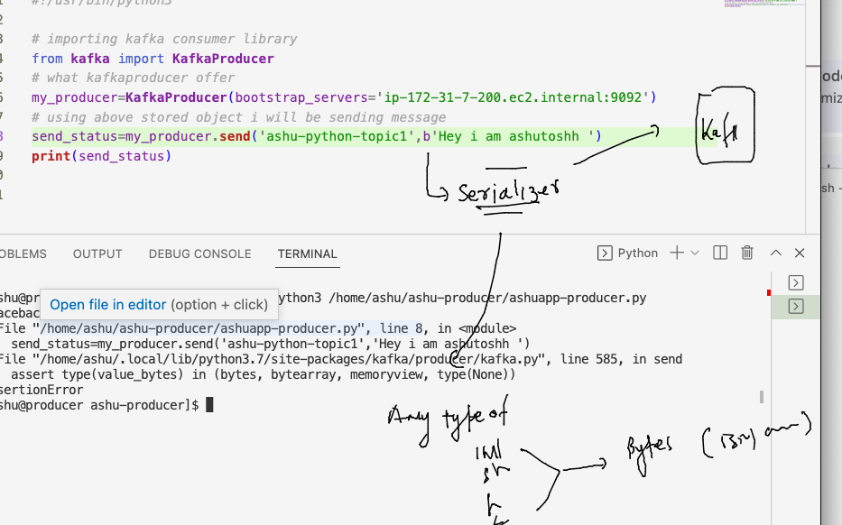

# Training plan 


### understanding kafka producer and consumers usign SDK 


### check kafka library support for python 

```
[ashu@producer ~]$ pip3 list  |   grep kafka
[ashu@producer ~]$ pip3 install kafka-python --user 
Collecting kafka-python
  Downloading kafka_python-2.0.2-py2.py3-none-any.whl (246 kB)
     |████████████████████████████████| 246 kB 32.5 MB/s 
Installing collected packages: kafka-python
Successfully installed kafka-python-2.0.2
[ashu@producer ~]$ pip3 list  |   grep kafka
kafka-python      2.0.2
[ashu@producer ~]$ 
```

### lets verify installation 

```
ashu@producer ~]$ python3
Python 3.7.15 (default, Oct 31 2022, 22:44:31) 
[GCC 7.3.1 20180712 (Red Hat 7.3.1-15)] on linux
Type "help", "copyright", "credits" or "license" for more information.
>>> import kafka 
>>> dir(kafka)
['BrokerConnection', 'ConsumerRebalanceListener', 'Deserializer', 'KafkaAdminClient', 'KafkaClient', 'KafkaConsumer', 'KafkaProducer', 'NullHandler', 'OffsetAndMetadata', 'Serializer', 'TopicPartition', '__all__', '__author__', '__builtins__', '__cached__', '__copyright__', '__doc__', '__file__', '__license__', '__loader__', '__name__', '__package__', '__path__', '__spec__', '__title__', '__version__', 'absolute_import', 'admin', 'client_async', 'cluster', 'codec', 'conn', 'consumer', 'coordinator', 'errors', 'future', 'logging', 'metrics', 'oauth', 'partitioner', 'producer', 'protocol', 'record', 'scram', 'serializer', 'structs', 'util', 'vendor', 'version']
>>> 
```

### lets write producer in python 

```
#!/usr/bin/python3

# importing kafka consumer library 
from kafka import KafkaProducer
# what kafkaproducer offer
my_producer=KafkaProducer(bootstrap_servers='ip-172-31-7-200.ec2.internal:9092')
# using above stored object i will be sending message 
send_status=my_producer.send('ashu-python-topic1','Hey i am ashutoshh ')
print(send_status)


```

### error while running above code 



### improve code 

```
#!/usr/bin/python3

# importing kafka consumer library 
from kafka import KafkaProducer
# what kafkaproducer offer
my_producer=KafkaProducer(bootstrap_servers='ip-172-31-7-200.ec2.internal:9092')
# using above stored object i will be sending message 
send_status=my_producer.send('ashu-python-topic1',b'Hey i am ashutoshh ')
send_status.get(timeout=10)
my_producer.flush()
print(send_status)


```

###  more change

```
#!/usr/bin/python3

# importing kafka consumer library 
from kafka import KafkaProducer
# what kafkaproducer offer
my_producer=KafkaProducer(bootstrap_servers='ip-172-31-7-200.ec2.internal:9092',compression_type='gzip')
# compression message to latency will improve 
# using above stored object i will be sending message 
for i in range(10):
    
    send_status=my_producer.send('ashu-python-topic1',b'hey i am 1234')
    send_status.get(timeout=10)
    my_producer.flush()
    print(send_status)


```


