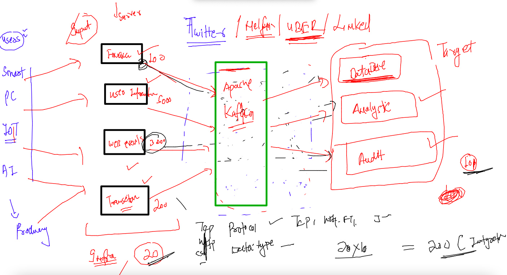
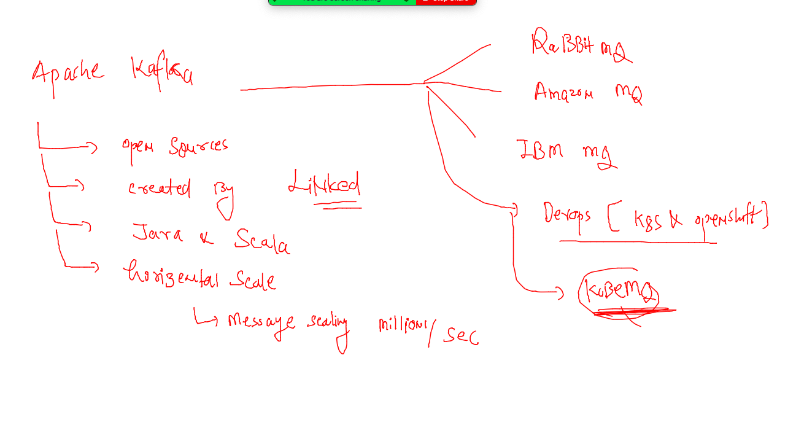
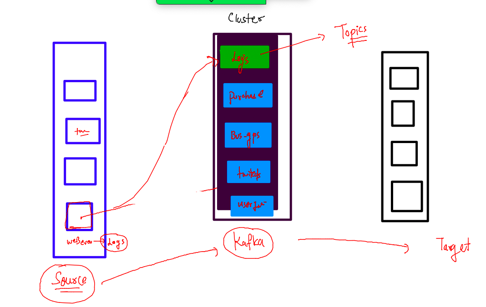
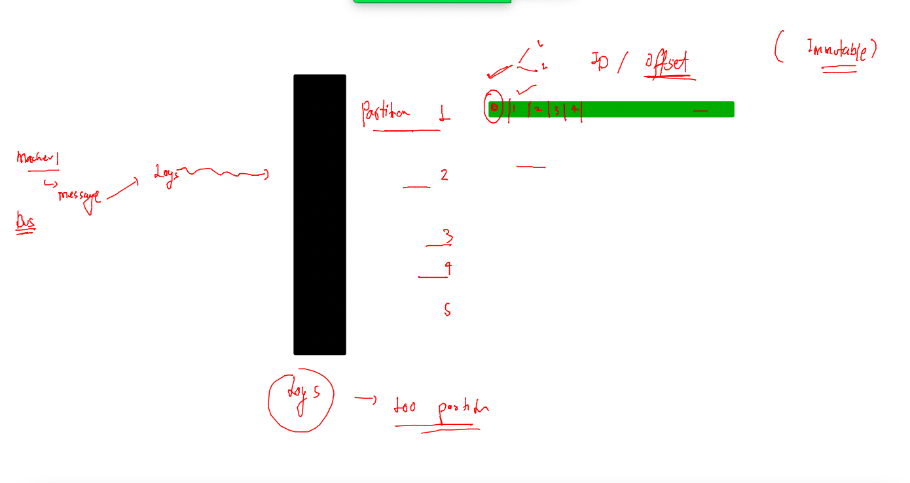

# Training plan 

## Understanding a big application and its connects/integratios --

### Introduction apache kafka

### more about apache kafka

## kafka store message data inside -- topics -- topics are having partitions 

### pic 1

### pic 2 

### pic 3

