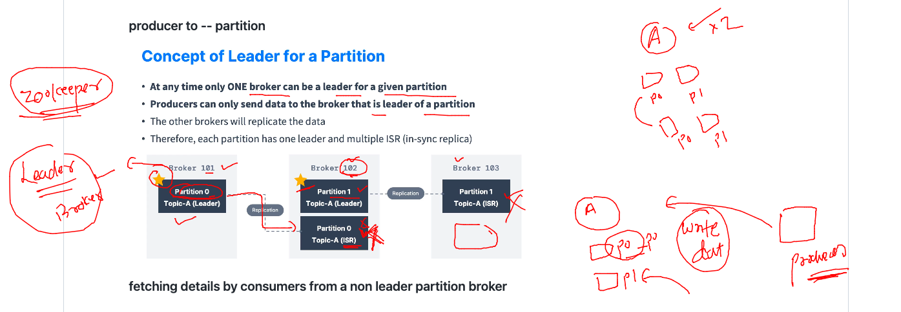

# Training plan 


## Kafka work plan Now 


### kafka client to kafka broker connection details 


### leader concept 



## lets test this 

### deleting topics 

```
[ashu@consumer ~]$ kafka-topics.sh   --bootstrap-server  44.200.244.234:9092  --delete --topic ashu-app-logs1
[ashu@consumer ~]$ kafka-topics.sh   --bootstrap-server  44.200.244.234:9092  --list
__consumer_offsets
amari-app-logs
andre-app-logs
andre-app-logs-3x3
anup-app-logs
dani-app-logs
luis-passos-logs
luis-passos-logs-2
luis-passos-logs-2x3
omkar-app-log
omkar-app-logs
pooja-app-logs
yasmin-app-logs
```

### testing it 

```
[ashu@consumer ~]$ kafka-topics.sh   --bootstrap-server  44.200.244.234:9092  --list
__consumer_offsets
amari-app-logs
anup-app-logs
ashu-data1
bruno-data1
dani-app-logs
omkar-app-log
omkar-app-logs
pooja-app-logs
yasmin-app-logs
[ashu@consumer ~]$ kafka-topics.sh   --bootstrap-server  44.200.244.234:9092  --topic ashu-data1 --describe 
Topic: ashu-data1       TopicId: x-5OCxIrRHGE89jPEQAwzA PartitionCount: 3       ReplicationFactor: 1    Configs: 
        Topic: ashu-data1       Partition: 0    Leader: 1       Replicas: 1     Isr: 1
        Topic: ashu-data1       Partition: 1    Leader: 2       Replicas: 2     Isr: 2
        Topic: ashu-data1       Partition: 2    Leader: 3       Replicas: 3     Isr: 3
[ashu@consumer ~]$ kafka-topics.sh   --bootstrap-server  44.200.244.234:9092  --create --topic ashu-data2 --replication-factor 2 --partitions 3 
Created topic ashu-data2.
[ashu@consumer ~]$ kafka-topics.sh   --bootstrap-server  44.200.244.234:9092  --topic ashu-data2 --describe 
Topic: ashu-data2       TopicId: QdAxqybfQfaxXQwu8rP5tA PartitionCount: 3       ReplicationFactor: 2    Configs: 
        Topic: ashu-data2       Partition: 0    Leader: 2       Replicas: 2,1   Isr: 2,1
        Topic: ashu-data2       Partition: 1    Leader: 3       Replicas: 3,2   Isr: 3,2
        Topic: ashu-data2       Partition: 2    Leader: 1       Replicas: 1,3   Isr: 1,3
[ashu@consumer ~]$ 
```


