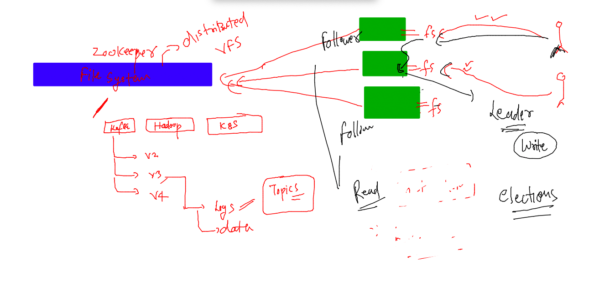
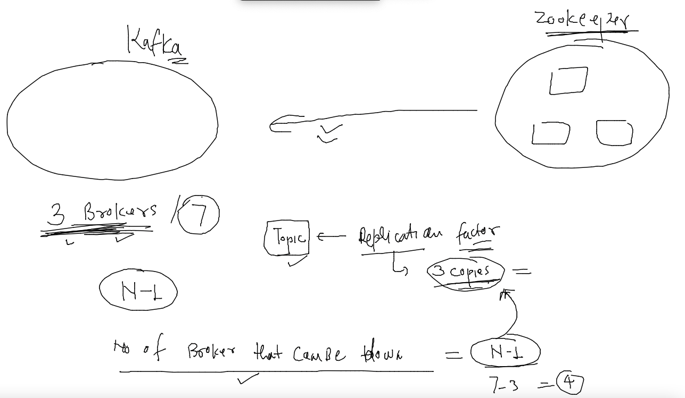

# Training plan 


## the best way to start single node / zookeeper + kafka setup

### adding PATH to shell env for kafka directory 

```
[ec2-user@ip-172-31-56-93 kafka_2.13-3.3.1]$ ls
bin  config  libs  LICENSE  licenses  NOTICE  site-docs
[ec2-user@ip-172-31-56-93 kafka_2.13-3.3.1]$ pwd
/home/ec2-user/kafka_2.13-3.3.1
[ec2-user@ip-172-31-56-93 kafka_2.13-3.3.1]$ cp  ~/.bashrc  . 
[ec2-user@ip-172-31-56-93 kafka_2.13-3.3.1]$ cp  .bashrc   ~/.bashrc 
[ec2-user@ip-172-31-56-93 kafka_2.13-3.3.1]$ cat ~/.bashrc 
# .bashrc

# Source global definitions
if [ -f /etc/bashrc ]; then
        . /etc/bashrc
fi

# Uncomment the following line if you don't like systemctl's auto-paging feature:
# export SYSTEMD_PAGER=

# User specific aliases and functions
KAFKA_HOME=/home/ec2-user/kafka_2.13-3.3.1
PATH=$PATH:$KAFKA_HOME/bin
export PATH 
[ec2-user@ip-172-31-56-93 kafka_2.13-3.3.1]$ source  ~/.bashrc 
```
### making service persistent on boot of system 

```
cat /etc/rc.local
/home/ec2-user/kafka_2.13-3.3.1/bin/zookeeper-server-start.sh  -daemon /home/ec2-user/kafka_2.13-3.3.1/config/zookeeper.properties
sleep 2 
/home/ec2-user/kafka_2.13-3.3.1/bin/kafka-server-start.sh  -daemon /home/ec2-user/kafka_2.13-3.3.1/config/server.properties
---
sudo chmod +x /etc/rc.local
```


### Understanding zookeeper configuration file 

### changing configuration details 

```

# the directory where the snapshot is stored.
dataDir=/var/lib/zookeeper
# the port at which the clients will connect
clientPort=2181
# disable the per-ip limit on the number of connections since this is a non-production config
maxClientCnxns=0
# Disable the adminserver by default to avoid port conflicts.
# Set the port to something non-conflicting if choosing to enable this
admin.enableServer=false
# admin.serverPort=8080

```

### stop and start 

```
[ec2-user@ip-172-31-56-93 kafka_2.13-3.3.1]$ ls
bin  config  libs  LICENSE  licenses  logs  NOTICE  rc.local  site-docs
[ec2-user@ip-172-31-56-93 kafka_2.13-3.3.1]$ sudo ./bin/zookeeper-server-stop.sh 
[ec2-user@ip-172-31-56-93 kafka_2.13-3.3.1]$ 
[ec2-user@ip-172-31-56-93 kafka_2.13-3.3.1]$ sudo ./bin/zookeeper-server-start.sh  -daemon  config/zookeeper.properties 
[ec2-user@ip-172-31-56-93 kafka_2.13-3.3.1]$ 

```
### lets verify 

```
[ec2-user@ip-172-31-56-93 kafka_2.13-3.3.1]$ sudo netstat -nlpt
Active Internet connections (only servers)
Proto Recv-Q Send-Q Local Address           Foreign Address         State       PID/Program name    
tcp        0      0 127.0.0.1:38593         0.0.0.0:*               LISTEN      5535/node           
tcp        0      0 0.0.0.0:111             0.0.0.0:*               LISTEN      2600/rpcbind        
tcp        0      0 0.0.0.0:22              0.0.0.0:*               LISTEN      3404/sshd           
tcp        0      0 127.0.0.1:25            0.0.0.0:*               LISTEN      3231/master         
tcp6       0      0 :::41919                :::*                    LISTEN      28369/java          
tcp6       0      0 :::2181                 :::*                    LISTEN      28369/java          
tcp6       0      0 :::111                  :::*                    LISTEN      2600/rpcbind        
tcp6       0      0 :::22                   :::*                    LISTEN      3404/sshd           
[ec2-user@ip-172-31-56-93 kafka_2.13-3.3.1]$ ls  /var/lib/
alternatives  chrony  dhclient  hibinit-agent  machines  nfs        postfix  rpm-state  systemd      yum
amazon        cloud   games     initramfs      misc      os-prober  rpcbind  rsyslog    update-motd  zookeeper
authconfig    dbus    gssproxy  logrotate      mlocate   plymouth   rpm      stateless  xfsdump
[ec2-user@ip-172-31-56-93 kafka_2.13-3.3.1]$ ls  /var/lib/zookeeper/
version-2
[ec2-user@ip-172-31-56-93 kafka_2.13-3.3.1]$ ls  /var/lib/zookeeper/version-2/
snapshot.0
```

### zookeeper more info 



### accessing zookeeper fs from local machine 

```
[ec2-user@ip-172-31-56-93 kafka_2.13-3.3.1]$ zookeeper-shell.sh  localhost:2181 
Connecting to localhost:2181
Welcome to ZooKeeper!
JLine support is disabled

WATCHER::

WatchedEvent state:SyncConnected type:None path:null
ls  /
[zookeeper]
help
ZooKeeper -server host:port [-zk-tls-config-file <file>] cmd args
        addWatch [-m mode] path # optional mode is one of [PERSISTENT, PERSISTENT_RECURSIVE] - default is PERSISTENT_RECURSIVE
        addauth scheme auth
        close 
        config [-c] [-w] [-s]
        connect host:port
        create [-s] [-e] [-c] [-t ttl] path [data] [acl]
        delete [-v version] path
        deleteall path [-b batch size]
        delquota [-n|-b] path
        get [-s] [-w] path
        getAcl [-s] path
        getAllChildrenNumber path
        getEphemerals path
        history 
        listquota path
        ls [-s] [-w] [-R] path
        printwatches on|off
        quit 
        reconfig [-s] [-v version] [[-file path] | [-members serverID=host:port1:port2;port3[,...]*]] | [-add serverId=host:port1:port2;port3[,...]]* [-remove serverId[,...]*]
        redo cmdno
        removewatches path [-c|-d|-a] [-l]
        set [-s] [-v version] path data
        setAcl [-s] [-v version] [-R] path acl
        setquota -n|-b val path
        stat [-w] path
        sync path
        version 
Command not found: Command not found help
create  /ashudata
Created /ashudata
ls  /
[ashudata, zookeeper]
```

### more info about zookeeper 


### adding 4lw in zookeeper config 

```
4lw.commands.whitelist=* 
---
167  sudo ./bin/zookeeper-server-stop.sh 
  168  sudo ./bin/zookeeper-server-start.sh  config/zookeeper.properties 
```

### lets test it 

```
ec2-user@ip-172-31-56-93 kafka_2.13-3.3.1]$ echo "stat"  |   nc  localhost 2181  
Zookeeper version: 3.6.3--6401e4ad2087061bc6b9f80dec2d69f2e3c8660a, built on 04/08/2021 16:35 GMT
Clients:
 /127.0.0.1:52304[0](queued=0,recved=1,sent=0)

Latency min/avg/max: 0/0.0/0
Received: 1
Sent: 0
Connections: 1
Outstanding: 0
Zxid: 0x3
Mode: standalone
Node count: 6
[ec2-user@ip-172-31-56-93 kafka_2.13-3.3.1]$ echo "ruok"  |   nc  localhost 2181  
imok[ec2-user@ip-172-31-56-93 kafka_2.13-3.3.1]$ 
[ec2-user@ip-172-31-56-93 kafka_2.13-3.3.1]$ 
[ec2-user@ip-172-31-56-93 kafka_2.13-3.3.1]$ echo "ruok"  |   nc  localhost 2181  ; echo 
imok
```

### Kafka cluster sizing -- with zookeeper 



### sample tempalte for kafka broker 1 

```
[root@ip-172-31-7-200 config]# cat  server.properties 
# This configuration file is intended for use in ZK-based mode, where Apache ZooKeeper is required.
# See kafka.server.KafkaConfig for additional details and defaults
#

############################# Server Basics #############################

# The id of the broker. This must be set to a unique integer for each broker.
broker.id=1

advertised.listeners=PLAINTEXT://ip-172-31-7-200.ec2.internal:9092
log.dirs=/var/log/kafka-logs
num.partitions=5
default.replication=2
delete.topic.enable=true
auto.create.topics.enable=true
zookeeper.connect=ip-172-31-7-200.ec2.internal:2181,ip-172-31-8-128.ec2.internal:2181,ip-172-31-9-177.ec2.internal:2181/mobikafka
############################# Socket Server Settings #############################


```

### now start kafka service 

```
/opt/kafka_2.13-3.3.1/bin/kafka-server-start.sh  -daemon /opt/kafka_2.13-3.3.1/config/server.properties
```

## COnnecting cluster and creating topics 


