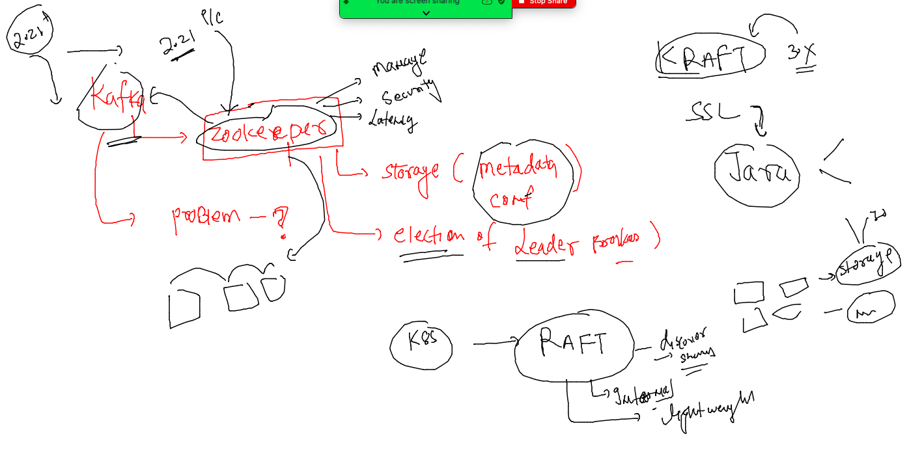

# Training plan 


### REvision 


### kafka with KRAFT 



### checking kraft 

```
[root@producer ~]# cd  /opt/kafka_2.13-3.3.1/
[root@producer kafka_2.13-3.3.1]# ls
LICENSE  NOTICE  bin  config  libs  licenses  site-docs
[root@producer kafka_2.13-3.3.1]# cd config/
[root@producer config]# ls
connect-console-sink.properties    connect-file-source.properties   consumer.properties  server.properties
connect-console-source.properties  connect-log4j.properties         kraft                tools-log4j.properties
connect-distributed.properties     connect-mirror-maker.properties  log4j.properties     trogdor.conf
connect-file-sink.properties       connect-standalone.properties    producer.properties  zookeeper.properties
[root@producer config]# cd kraft/
[root@producer kraft]# ls
README.md  broker.properties  controller.properties  server.properties
[root@producer kraft]# 


```

### start kafka without zookeeper -- using kraft 

```
 60  kafka-storage.sh --help
   61  kafka-storage.sh random-uuid 
   62  kafka-storage.sh format -t 63zWeUnUSVKWSW5wdtP9KA  -c /opt/kafka_2.13-3.3.1/config/kraft/server.properties  
   63  kafka-server-start.sh  /opt/kafka_2.13-3.3.1/config/kraft/server.properties 
   64  kafka-server-start.sh -daemon  /opt/kafka_2.13-3.3.1/config/kraft/server.properties 
```

### can stop kafka like before 

```
[root@producer kraft]# kafka-server-stop.sh 
[root@producer kraft]# 
[root@producer kraft]# netstat -nlpt
Active Internet connections (only servers)
Proto Recv-Q Send-Q Local Address           Foreign Address         State       PID/Program name    
tcp        0      0 0.0.0.0:22              0.0.0.0:*               LISTEN      3217/sshd           
tcp        0      0 127.0.0.1:25            0.0.0.0:*               LISTEN      3164/master         
tcp        0      0 127.0.0.1:37117         0.0.0.0:*               LISTEN      4621/node           
tcp        0      0 127.0.0.1:35105         0.0.0.0:*               LISTEN      17121/node          
tcp        0      0 127.0.0.1:43905         0.0.0.0:*               LISTEN      5999/node           
tcp        0      0 127.0.0.1:44267         0.0.0.0:*               LISTEN      6563/node           
tcp        0      0 0.0.0.0:111             0.0.0.0:*               LISTEN      2760/rpcbind        
tcp6       0      0 :::22                   :::*                    LISTEN      3217/sshd           
tcp6       0      0 :::111                  :::*                    LISTEN      2760/rpcbind       
```

## configure SSL serts for kafka setup 

### creating self CA 

```
[root@producer ssl-certs]# mkdir  self-ca  zookeeper  kafkabr  kfclients zooclients 
[root@producer ssl-certs]# cd self-ca/
[root@producer self-ca]# openssl req -new -x509 -keyout ca-key -out ca-cert -days 3650
Generating a 2048 bit RSA private key
......+++
.............+++
writing new private key to 'ca-key'
Enter PEM pass phrase:
Verifying - Enter PEM pass phrase:
-----
You are about to be asked to enter information that will be incorporated
into your certificate request.
What you are about to enter is what is called a Distinguished Name or a DN.
There are quite a few fields but you can leave some blank
For some fields there will be a default value,
If you enter '.', the field will be left blank.
-----
Country Name (2 letter code) [XX]:IN
State or Province Name (full name) []:RAJ
Locality Name (eg, city) [Default City]:JAI
Organization Name (eg, company) [Default Company Ltd]:adhoc
Organizational Unit Name (eg, section) []:tech
Common Name (eg, your name or your server's hostname) []:localhost
Email Address []:
[root@producer self-ca]# ls
ca-cert  ca-key

```

### create certs for zookeeper server 

```
 keytool -keystore kafka.zookeeper.truststore.jks -alias ca-cert -import -file ../self-ca/ca-cert
 keytool -keystore kafka.zookeeper.keystore.jks -alias zookeeper -validity 3650 -genkey -keyalg RSA -ext SAN=dns:localhost
 keytool -keystore kafka.zookeeper.keystore.jks -alias zookeeper -certreq -file ca-request-zookeeper
 ls
 ca-request-zookeeper
```
### send above listed file to CA for signing 

```
openssl x509 -req -CA ../self-ca/ca-cert -CAkey ../self-ca/ca-key -in ca-request-zookeeper -out ca-signed-zookeeper -days 3650 -CAcreateserial

ls
ca-signed-zookeeper
```

### import ca cert and ca signed cert to zookeeper store 

```
keytool -keystore kafka.zookeeper.keystore.jks -alias ca-cert -import -file ../self-ca/ca-cert
keytool -keystore kafka.zookeeper.keystore.jks -alias zookeeper -import -file ca-signed-zookeeper
```

### zookeeper conf file for ssl

```
secureClientPort=2182
authProvider.x509=org.apache.zookeeper.server.auth.X509AuthenticationProvider
serverCnxnFactory=org.apache.zookeeper.server.NettyServerCnxnFactory
ssl.trustStore.location=/opt/kafka_2.13-3.3.1/ssl-certs/zookeeper/kafka.zookeeper.truststore.jks
ssl.trustStore.password=Kafka@0
ssl.keyStore.location=/opt/kafka_2.13-3.3.1/ssl-certs/zookeeper/kafka.zookeeper.keystore.jks
ssl.keyStore.password=Kafka@0
ssl.clientAuth=need
```

### zoo client can't connect without SSL conf 

```
t@producer zooclients]# zookeeper-shell.sh  localhost:2182
Connecting to localhost:2182
Welcome to ZooKeeper!
JLine support is disabled
[2022-12-09 11:04:41,058] WARN Session 0x0 for sever localhost/127.0.0.1:2182, Closing socket connection. Attempting reconnect except it is a SessionExpiredException. (org.apache.zookeeper.ClientCnxn)
EndOfStreamException: Unable to read additional data from server sessionid 0x0, likely server has closed socket
	at org.apache.zookeeper.ClientCnxnSocketNIO.doIO(ClientCnxnSocketNIO.java:77)
	at org.apache.zookeeper.ClientCnxnSocketNIO.doTransport(ClientCnxnSocketNIO.java:350)
	at org.apache.zookeeper.ClientCnxn$S
```

### time to create SSL for ZOOclient also  same as for server we did 

### 
```
134  keytool -keystore kafka.zooclient.truststore.jks -alias ca-cert -import -file ca-cert
  135  keytool -keystore kafka.zooclient.truststore.jks -alias ca-cert -import -file ../self-ca/ca-cert
  136  history 
  137  ls
  138  keytool -keystore kafka.zooclient.keystore.jks -alias zookeeper -validity 3650 -genkey -keyalg RSA -ext SAN=dns:localhost
  139  ls
  140  history 
  141  ls
  142  keytool -keystore kafka.zooclient .keystore.jks -alias zookeeper -certreq -file ca-request-zookeeper
  143  ls
  144  keytool -keystore kafka.zooclient.keystore.jks -alias zookeeper -certreq -file ca-request-zooclient
  145  ls
  146  openssl x509 -req -CA ../self-ca/ca-cert -CAkey ../self-ca/ca-key -in ca-request-zooclient -out ca-signed-zooclient -days 3650 -CAcreateserial
  147  ls
  148  keytool -keystore kafka.zooclient.keystore.jks -alias ca-cert -import -file ../self-ca/ca-cert
  149  ls
  150  history 
  151  ls
  152  keytool -keystore kafka.zooclient.keystore.jks -alias zookeeper -import -file ca-signed-zooclient
```

### creating ssl conf file to be used by shell client 

cat clien-cert.properties 
```
[root@producer java-zoo-client]# cat  clien-cert.properties 
# /opt/kafka_2.13-3.3.1/ssl-certs/zooclients  all the certs are present 
zookeeper.connect=localhost:2182
zookeeper.clientCnxnSocket=org.apache.zookeeper.ClientCnxnSocketNetty
zookeeper.ssl.client.enable=true
zookeeper.ssl.protocol=TLSv1.2
zookeeper.ssl.truststore.location=/opt/kafka_2.13-3.3.1/ssl-certs/zooclients/kafka.zooclient.truststore.jks
zookeeper.ssl.truststore.password=Kafka@0
zookeeper.ssl.keystore.location=/opt/kafka_2.13-3.3.1/ssl-certs/zooclients/kafka.zooclient.keystore.jks
zookeeper.ssl.keystore.password=Kafka@0
# optinaal 
zookeeper.set.acl=true

```

### How to connect zookeeper server -- either using shell /python / java 

```
[root@producer java-zoo-client]# zookeeper-shell.sh  localhost:2182  -zk-tls-config-file  clien-cert.properties  
Connecting to localhost:2182
Welcome to ZooKeeper!
JLine support is disabled

WATCHER::

WatchedEvent state:SyncConnected type:None path:null
ls /
[zookeeper]
```


