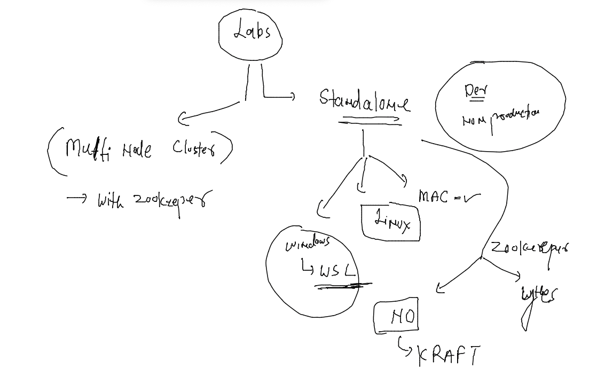

# Training plan 


## Understanding a big application and its connects/integratios --

### Introduction apache kafka


### more about apache kafka


## kafka store message data inside -- topics -- topics are having partitions 

### pic 1


### pic 2 


### pic 3


## Labs for kafka 



## aws cloud vm login -- from mac book 

```
fire@ashutoshhs-MacBook-Air ~ % cd Downloads
fire@ashutoshhs-MacBook-Air Downloads % 
fire@ashutoshhs-MacBook-Air Downloads % chmod 400 ashu-kafka-key.pem 
fire@ashutoshhs-MacBook-Air Downloads % 
fire@ashutoshhs-MacBook-Air Downloads % ssh -i ashu-kafka-key.pem   ec2-user@54.237.41.75
The authenticity of host '54.237.41.75 (54.237.41.75)' can't be established.
ECDSA key fingerprint is SHA256:c7g/IfkPqUb8hkvKq6ymxYkojvlxAzxxuIrDvcqZHTU.
Are you sure you want to continue connecting (yes/no/[fingerprint])? yes
Warning: Permanently added '54.237.41.75' (ECDSA) to the list of known hosts.

       __|  __|_  )
       _|  (     /   Amazon Linux 2 AMI
      ___|\___|___|

https://aws.amazon.com/amazon-linux-2/
1 package(s) needed for security, out of 1 available
Run "sudo yum update" to apply all updates.
-bash: warning: setlocale: LC_CTYPE: cannot change locale (UTF-8): No such file or directory
[ec2-user@ip-172-31-56-93 ~]$ 
[ec2-user@ip-172-31-56-93 ~]$ 
[ec2-user@ip-172-31-56-93 ~]$ 
```

### from Windows 

```

```


