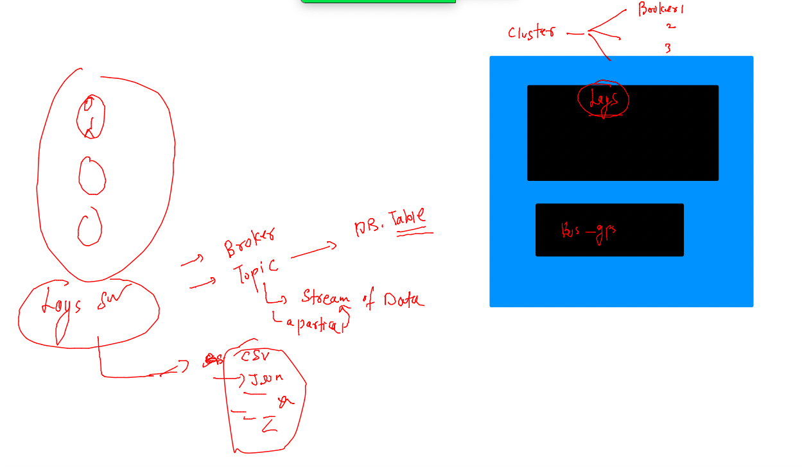
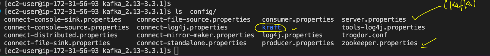

# Training plan 


## Understanding a big application and its connects/integratios --

### Introduction apache kafka


### more about apache kafka


## kafka store message data inside -- topics -- topics are having partitions 

### pic 1


### pic 2 



### pic 3


## Labs for kafka 


## aws cloud vm login -- from mac book 

```
fire@ashutoshhs-MacBook-Air ~ % cd Downloads
fire@ashutoshhs-MacBook-Air Downloads % 
fire@ashutoshhs-MacBook-Air Downloads % chmod 400 ashu-kafka-key.pem 
fire@ashutoshhs-MacBook-Air Downloads % 
fire@ashutoshhs-MacBook-Air Downloads % ssh -i ashu-kafka-key.pem   ec2-user@54.237.41.75
The authenticity of host '54.237.41.75 (54.237.41.75)' can't be established.
ECDSA key fingerprint is SHA256:c7g/IfkPqUb8hkvKq6ymxYkojvlxAzxxuIrDvcqZHTU.
Are you sure you want to continue connecting (yes/no/[fingerprint])? yes
Warning: Permanently added '54.237.41.75' (ECDSA) to the list of known hosts.

       __|  __|_  )
       _|  (     /   Amazon Linux 2 AMI
      ___|\___|___|

https://aws.amazon.com/amazon-linux-2/
1 package(s) needed for security, out of 1 available
Run "sudo yum update" to apply all updates.
-bash: warning: setlocale: LC_CTYPE: cannot change locale (UTF-8): No such file or directory
[ec2-user@ip-172-31-56-93 ~]$ 
[ec2-user@ip-172-31-56-93 ~]$ 
[ec2-user@ip-172-31-56-93 ~]$ 
```


## Kafka Pre-requisite : 

### jdk 11 & scala 

### Install jdk11 in linux vm on amazon cloud 
### using amazon corretto to install jdk in any platform 

```
sudo amazon-linux-extras install java-openjdk11
```

### lets verify 

```
ec2-user@ip-172-31-56-93 ~]$ java -version 
openjdk version "11.0.16" 2022-07-19 LTS
OpenJDK Runtime Environment (Red_Hat-11.0.16.0.8-1.amzn2.0.1) (build 11.0.16+8-LTS)
OpenJDK 64-Bit Server VM (Red_Hat-11.0.16.0.8-1.amzn2.0.1) (build 11.0.16+8-LTS, mixed mode, sharing)
```

### Downloading kafka 3.3 with scala 2.13 support 

[linkto_download](https://kafka.apache.org/downloads)

```
ec2-user@ip-172-31-56-93 ~]$ wget  https://downloads.apache.org/kafka/3.3.1/kafka_2.13-3.3.1.tgz
--2022-12-05 13:20:25--  https://downloads.apache.org/kafka/3.3.1/kafka_2.13-3.3.1.tgz
Resolving downloads.apache.org (downloads.apache.org)... 135.181.214.104, 88.99.95.219, 2a01:4f8:10a:201a::2, ...
Connecting to downloads.apache.org (downloads.apache.org)|135.181.214.104|:443... connected.
HTTP request sent, awaiting response... 200 OK
Length: 105053134 (100M) [application/x-gzip]
Saving to: ‘kafka_2.13-3.3.1.tgz’

100%[============================================================================================================================>] 105,053,134 14.6MB/s   in 7.6s   

2022-12-05 13:20:33 (13.1 MB/s) - ‘kafka_2.13-3.3.1.tgz’ saved [105053134/105053134]

[ec2-user@ip-172-31-56-93 ~]$ ls
kafka_2.13-3.3.1.tgz
```

### extract it 

```
 tar  xvzf  kafka_2.13-3.3.1.tgz 
 ec2-user@ip-172-31-56-93 ~]$ ls
kafka_2.13-3.3.1  kafka_2.13-3.3.1.tgz
```

### lets explore 

```
[ec2-user@ip-172-31-56-93 ~]$ cd  kafka_2.13-3.3.1/
[ec2-user@ip-172-31-56-93 kafka_2.13-3.3.1]$ ls
bin  config  libs  LICENSE  licenses  NOTICE  site-docs
[ec2-user@ip-172-31-56-93 kafka_2.13-3.3.1]$ 
```

### Understanding configuration directory 



### checking bin directory 

```
ec2-user@ip-172-31-56-93 kafka_2.13-3.3.1]$ ls bin/
connect-distributed.sh        kafka-consumer-perf-test.sh  kafka-mirror-maker.sh               kafka-transactions.sh
connect-mirror-maker.sh       kafka-delegation-tokens.sh   kafka-producer-perf-test.sh         kafka-verifiable-consumer.sh
connect-standalone.sh         kafka-delete-records.sh      kafka-reassign-partitions.sh        kafka-verifiable-producer.sh
kafka-acls.sh                 kafka-dump-log.sh            kafka-replica-verification.sh       trogdor.sh
kafka-broker-api-versions.sh  kafka-features.sh            kafka-run-class.sh                  windows
kafka-cluster.sh              kafka-get-offsets.sh         kafka-server-start.sh               zookeeper-security-migration.sh
kafka-configs.sh              kafka-leader-election.sh     kafka-server-stop.sh                zookeeper-server-start.sh
kafka-console-consumer.sh     kafka-log-dirs.sh            kafka-storage.sh                    zookeeper-server-stop.sh
kafka-console-producer.sh     kafka-metadata-quorum.sh     kafka-streams-application-reset.sh  zookeeper-shell.sh
kafka-consumer-groups.sh      kafka-metadata-shell.sh      kafka-topics.sh
[ec2-user@ip-172-31-56-93 kafka_2.13-3.3.1]$ 

```

### start zookeeper 

```
[ec2-user@ip-172-31-56-93 kafka_2.13-3.3.1]$ ls
bin  config  libs  LICENSE  licenses  NOTICE  site-docs
[ec2-user@ip-172-31-56-93 kafka_2.13-3.3.1]$ ./bin/zookeeper-server-start.sh   
USAGE: ./bin/zookeeper-server-start.sh [-daemon] zookeeper.properties
[ec2-user@ip-172-31-56-93 kafka_2.13-3.3.1]$ ./bin/zookeeper-server-start.sh   config/zookeeper.properties 
[2022-12-05 13:39:12,260] INFO Reading configuration from: config/zookeeper.properties (org.apache.zookeeper.server.quorum.QuorumPeerConfig)
[2022-12-05 13:39:12,271] WARN config/zookeeper.properties is relative. Prepend ./ to indicate that you're sure! (org.apache.zookeeper.server.quorum.QuorumPeerConfig)
[2022-12-05 13:39:12,283] INFO clientPortAddress is 0.0.0.0:2181 (org.apache.zookeeper.server.quorum.QuorumPeerConfig)
[2022-12-05 13:39:12,284] INFO secureClientPort is not set (org.apache.zookeeper.server.quorum.QuorumPeerConfig)
[2022-12-05 13:39:12,284] INFO observerMasterPort is not set (org.apache.zookeeper.server.quorum.QuorumPeerConfig)
[2022-12-05 13:39:12,285] IN
```

### in another termianl start kafka as well

```
[ec2-user@ip-172-31-56-93 kafka_2.13-3.3.1]$ ls
bin  config  libs  LICENSE  licenses  logs  NOTICE  site-docs
[ec2-user@ip-172-31-56-93 kafka_2.13-3.3.1]$ ./bin/kafka-
kafka-acls.sh                       kafka-dump-log.sh                   kafka-replica-verification.sh
kafka-broker-api-versions.sh        kafka-features.sh                   kafka-run-class.sh
kafka-cluster.sh                    kafka-get-offsets.sh                kafka-server-start.sh
kafka-configs.sh                    kafka-leader-election.sh            kafka-server-stop.sh
kafka-console-consumer.sh           kafka-log-dirs.sh                   kafka-storage.sh
kafka-console-producer.sh           kafka-metadata-quorum.sh            kafka-streams-application-reset.sh
kafka-consumer-groups.sh            kafka-metadata-shell.sh             kafka-topics.sh
kafka-consumer-perf-test.sh         kafka-mirror-maker.sh               kafka-transactions.sh
kafka-delegation-tokens.sh          kafka-producer-perf-test.sh         kafka-verifiable-consumer.sh
kafka-delete-records.sh             kafka-reassign-partitions.sh        kafka-verifiable-producer.sh
[ec2-user@ip-172-31-56-93 kafka_2.13-3.3.1]$ ./bin/kafka-server-start.sh    config/server.properties 
[2022-12-05 13:41:20,934] INFO Registered kafka:type=kafka.Log4jController MBean (kafka.utils.Log4jControllerRegistration$)
[2022-12-05 13:41:21,480] INFO Setting -D jdk.tls.rejectClientInitiatedRenegotiation=true to disable client-initiated TLS renegotiation (org.apache.zookeeper.common.X509Util)
[2022-12-05 13:41:21,684] INFO Registered signal handlers for TERM, INT, HUP (org.apache.kafka.common.utils.LoggingSignalHandler)
[2022-12-05 13:41:21,688] INFO starting (kafka.server.KafkaServer)
[2022-12-05 13:41:21,689] INFO Connecting to zookeeper on localhost:2181 (kafka.server.KafkaServer)
[2022-12-05 13:41:21,737] INFO [ZooKeeperClient Kafka server] Initializing a new session to localhost:2181. (kafka.zookeeper.ZooKeeperClient)
[2022-12-05 13:41:21,750] INFO Client environment:zookeeper.version=3.6.3--6401e4ad2087061bc6b9f80dec2d69f2e3c8660a, built on 04/08/2021 16:35 GMT (org.apache.zookeeper.ZooKeeper)
[2022-12-05 13:41:21,751] INFO Client environment:host.na
```


### above scripts are dependent on -- terminal / remote session 

### lets create systemd service for them 

### taking a copy of sshd.service for zookeeper and for kafka as well

```
[ec2-user@ip-172-31-56-93 kafka_2.13-3.3.1]$ systemctl status sshd
● sshd.service - OpenSSH server daemon
   Loaded: loaded (/usr/lib/systemd/system/sshd.service; enabled; vendor preset: enabled)
   Active: active (running) since Mon 2022-12-05 11:45:51 UTC; 2h 5min ago
     Docs: man:sshd(8)
           man:sshd_config(5)
 Main PID: 3522 (sshd)
   CGroup: /system.slice/sshd.service
           ├─ 3522 /usr/sbin/sshd -D
           ├─18934 sshd: root [priv]
           └─18941 sshd: root [net]

Dec 05 13:49:59 ip-172-31-56-93.ec2.internal sshd[18223]: pam_unix(sshd:auth): authentication failure; logname= uid=0 euid=0 tty=ssh...80.241
Dec 05 13:50:01 ip-172-31-56-93.ec2.internal sshd[18223]: Failed password for invalid user romeo from 177.15.80.241 port 31258 ssh2
Dec 05 13:50:02 ip-172-31-56-93.ec2.internal sshd[18223]: Received disconnect from 177.15.80.241 port 31258:11: Bye Bye [preauth]
Dec 05 13:50:02 ip-172-31-56-93.ec2.internal sshd[18223]: Disconnected from 177.15.80.241 port 31258 [preauth]
Dec 05 13:51:36 ip-172-31-56-93.ec2.internal sshd[18889]: pam_unix(sshd:auth): authentication failure; logname= uid=0 euid=0 tty=ssh...r=root
Dec 05 13:51:38 ip-172-31-56-93.ec2.internal sshd[18889]: Failed password for root from 177.15.80.241 port 31267 ssh2
Dec 05 13:51:40 ip-172-31-56-93.ec2.internal sshd[18889]: Received disconnect from 177.15.80.241 port 31267:11: Bye Bye [preauth]
Dec 05 13:51:40 ip-172-31-56-93.ec2.internal sshd[18889]: Disconnected from 177.15.80.241 port 31267 [preauth]
Dec 05 13:51:44 ip-172-31-56-93.ec2.internal sshd[18934]: pam_unix(sshd:auth): authentication failure; logname= uid=0 euid=0 tty=ssh...r=root
Dec 05 13:51:47 ip-172-31-56-93.ec2.internal sshd[18934]: Failed password for root from 27.71.238.138 port 58852 ssh2
Hint: Some lines were ellipsized, use -l to show in full.
[ec2-user@ip-172-31-56-93 kafka_2.13-3.3.1]$ cp /usr/lib/systemd/system/sshd.service  .
[ec2-user@ip-172-31-56-93 kafka_2.13-3.3.1]$ 
```

### creating zookeeper.service file 

```
[Unit]
Description=zookeeper service file 
After=network.target 


[Service]
Type=notify
ExecStart=/home/ec2-user/kafka_2.13-3.3.1/bin/zookeeper-server-start.sh -daemon /home/ec2-user/kafka_2.13-3.3.1/config/zookeeper.properties
ExecStop=/home/ec2-user/kafka_2.13-3.3.1/bin/zookeeper-server-stop.sh /home/ec2-user/kafka_2.13-3.3.1/config/zookeeper.properties 
Restart=on-failure
RestartSec=5s

[Install]
WantedBy=multi-user.target

```

###  copy it to then systemd location 

```
sudo cp  zookeeper.service  -v  /usr/lib/systemd/system/
sudo systemctl daemon-reload 
sudo systemctl start zookeeper.service
```


### alternative to systemd you can use -daemon option 

```
[ec2-user@ip-172-31-56-93 kafka_2.13-3.3.1]$ /home/ec2-user/kafka_2.13-3.3.1/bin/zookeeper-server-start.sh -daemon  /home/ec2-user/kafka_2.13-3.3.1/config/zookeeper.properties
[ec2-user@ip-172-31-56-93 kafka_2.13-3.3.1]$ ./bin/kafka-server-start.sh 
USAGE: ./bin/kafka-server-start.sh [-daemon] server.properties [--override property=value]*
[ec2-user@ip-172-31-56-93 kafka_2.13-3.3.1]$ ./bin/kafka-server-start.sh -daemon config/server.properties 
[ec2-user@ip-172-31-56-93 kafka_2.13-3.3.1]$ 

```

